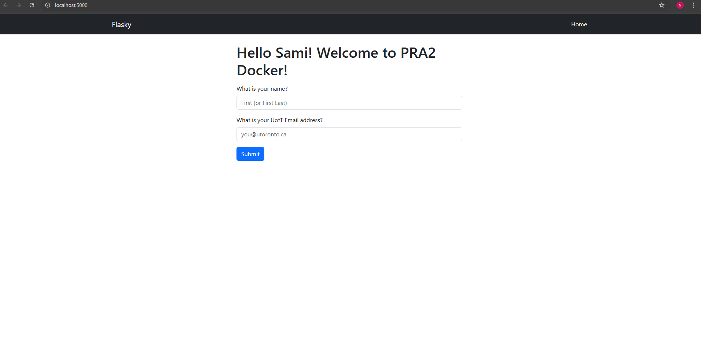

# E444-F2025-PRA2

**Student:** Sami Najim
 
Source code reference: https://github.com/miguelgrinberg/flasky

## Activity 1.4 Screenshot

Fill in your first name and last name in the 1st field, and fill in your NON UofT email in the 2nd field, then click **Submit**.

## Activity 2.4: Docker Build and Run

Built the Docker image and successfully ran the container.  
Verified the Flask app running inside Docker and confirmed it appears in `docker ps -a`.

